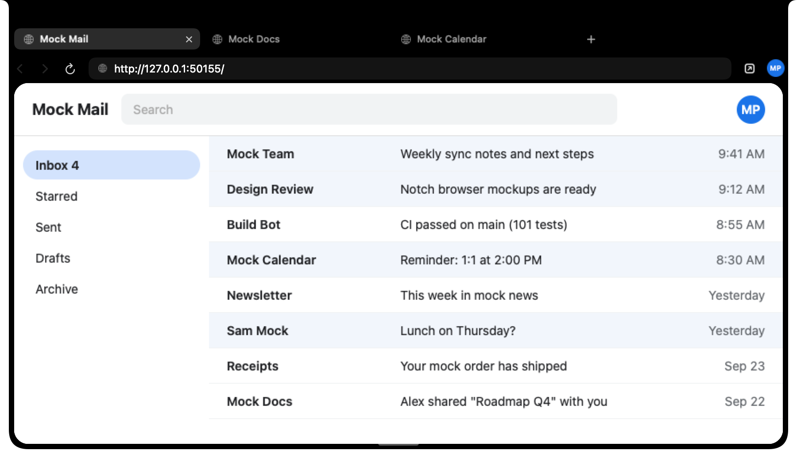

# Botch

A tiny browser that lives in the notch. Hover the notch on your MacBook (or the pill at the top
of an external display) and it expands into a tabbed WebKit browser signed in with one of your
Google Chrome profiles.



## Install

```sh
curl -fsSL https://raw.githubusercontent.com/pulkitxm/botch/main/install.sh | bash
```

This downloads the latest release, installs `Botch.app` to `/Applications`, removes the
quarantine attribute and launches it. Builds are ad-hoc signed and not notarized, which is why
the script clears quarantine; otherwise Gatekeeper refuses to open the app. Releases are also on
the [releases page](https://github.com/pulkitxm/botch/releases) as a zip and a dmg.

Requirements: macOS 14 or later, Apple Silicon, Google Chrome installed with at least one
profile.

## Use

1. On first launch a small window explains Botch and lets you turn it on, launch it at login and
   open the notch.
2. Hover the notch (0.1 s) or click it. Botch checks that Chrome is installed and is the default
   browser, then lists your Chrome profiles.
3. Pick a profile. macOS asks for access to the "Chrome Safe Storage" keychain item once per
   build; choose Always Allow. Botch decrypts that profile's cookies and copies its local storage
   into a private WebKit data store, so sites open already signed in.
4. Browse. Tabs reorder by drag and have a context menu; Cmd+T, Cmd+W, Cmd+L, Cmd+R,
   Cmd+1 to 9, Cmd+[ and ] work as in Chrome. Links can open in Chrome with the same profile.
   Drag the bottom handle or corners to resize; the size is remembered.
5. Move the pointer away and the notch collapses. Tabs, the selected tab and the profile are
   restored next time.

The menu bar item has Open Browser, Settings, Check for Updates (opens the releases page) and
Quit. Settings: Enabled, Launch at login, Open on hover, Require the Option key to open, Show on
external displays, Search engine (Google, DuckDuckGo, Bing, Kagi) and Detach profile.

## What comes from Chrome

Transferred on attach and refreshed every 5 minutes while you use it: cookies (including HttpOnly
and Secure cookies) and per-origin localStorage. Not transferred: IndexedDB, service workers,
saved passwords, extensions, history and bookmarks. Partitioned cookies stay in Chrome.

## Privacy

Everything stays on this Mac. Botch reads Chrome's files on disk, decrypts cookies with the key
from your login keychain and writes them into a WebKit data store under
`~/Library/WebKit/com.pulkit.botch`. Nothing is uploaded anywhere and there is no telemetry.
Detach Profile and Clear Data in the profile menu removes that store.

## Build from source

```sh
git clone https://github.com/pulkitxm/botch.git && cd botch
make test
make app
open dist/Botch.app
```

Needs Xcode 26 or later.

## Uninstall

Quit Botch from the menu bar, then:

```sh
rm -rf /Applications/Botch.app ~/Library/Application\ Support/Botch \
  ~/Library/WebKit/com.pulkit.botch
defaults delete com.pulkit.botch
```

## Known caveats

- Ad-hoc signatures change with every build, so macOS asks for the Chrome Safe Storage keychain
  permission again after each update.
- If you also run Edith with its Notch Shelf enabled, both apps draw at the notch and overlap.
  Turn one of them off.
- Without a notch (external display only) the browser hangs from a small pill at the top of the
  screen.

## License

GPL-3.0. Botch is derived from the Notch Browser in Edith.
